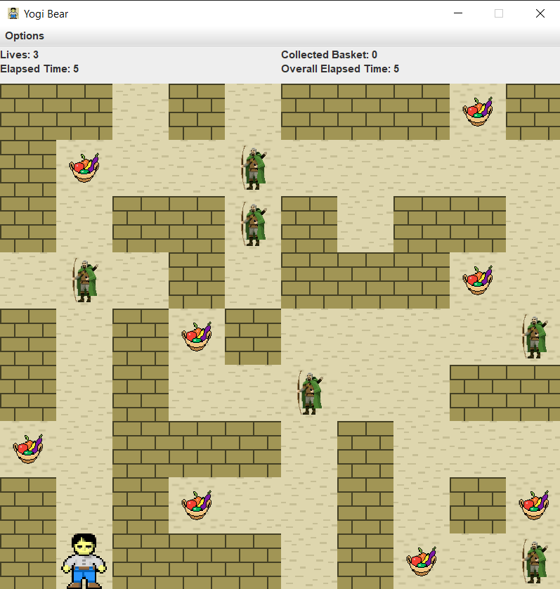
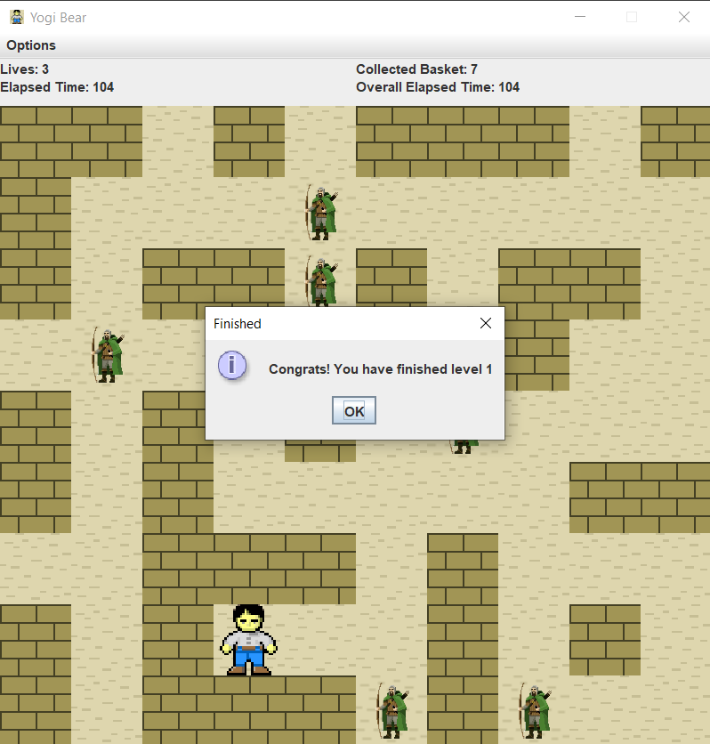
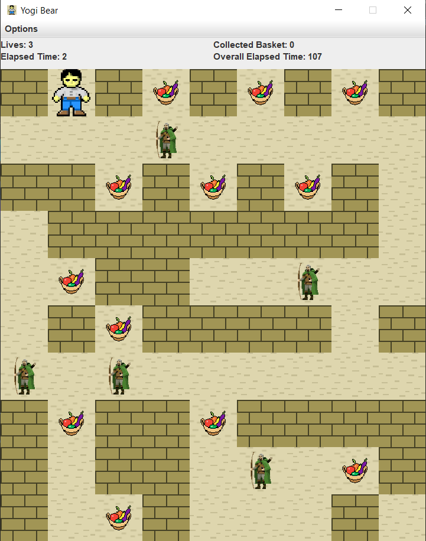

# yogi-bear
Yogi Bear game is to collect every basket.

## Description

Yogi Bear wants to collect all the picnic baskets in the forest of the Yellowstone National Park. This 
park contains mountains and trees, that are obstacles for Yogi. Besided the obstacles, there are rangers, 
who make it harder for Yogi to collect the baskets. Rangers can move only horizontally or vertically in 
the park. If a ranger gets too close (one unit distance) to Yogi, then Yogi loses one life. (It is up to you 
to define the unit, but it should be at least that wide, as the sprite of Yogi.) 

If Yogi still has at least one life from the original three, then he spawns at the entrance of the park. 
During the adventures of Yogi, the game counts the number of picnic baskets, that Yogi collected. If 
all the baskets are collected, then load a new game level, or generate one. If Yogi loses all his lives, 
then show a popup messagebox, where the player can type his name and save it to the database. Create 
a menu item, which displays a highscore table of the players for the 10 best scores. Also, create a 
menu item which restarts the game.

### **Developer Documentation can be checked [here](documentation.pdf).**
